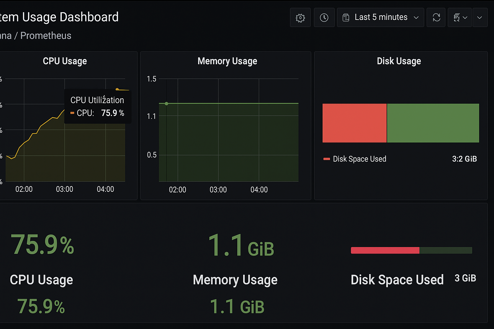

# Monitoramento com Grafana + Prometheus

Este projeto demonstra como configurar um ambiente de monitoramento utilizando Grafana e Prometheus com Node Exporter, tudo executado via Docker Compose.

## 📌 Objetivo

Implementar um sistema de monitoramento moderno e extensível, capaz de coletar métricas de CPU, memória, disco e rede, e exibir visualmente essas informações em painéis interativos no Grafana.

## ⚙️ Serviços Utilizados

- **Prometheus**: Coleta métricas do sistema via Node Exporter.
- **Grafana**: Exibe dashboards interativos com dados extraídos do Prometheus.
- **Node Exporter**: Exporta métricas do host para o Prometheus.

## 🚀 Como Executar

1. Clone este repositório:

```bash
git clone https://github.com/ThomazLCavalcanti/monitoramento-grafana-prometheus.git
cd monitoramento-grafana-prometheus
```

2. Suba o ambiente com Docker Compose:

```bash
docker-compose up -d
```

3. Acesse a interface do Grafana:

```
http://localhost:3000
Usuário: admin
Senha: admin
```

4. O Prometheus estará disponível em:

```
http://localhost:9090
```

## 🔧 Testes de Carga

Você pode executar os testes de carga local para simular uso de CPU e memória:

```bash
bash scripts/test_cpu_load.sh
bash scripts/test_memory_load.sh
```

Esses scripts ajudarão a testar se os gráficos estão capturando corretamente as alterações no uso dos recursos.

## 🧠 Métricas Monitoradas

- Uso de CPU (%)
- Uso de Memória RAM
- Espaço em disco
- Rede (upload/download)
- Uptime do host

## 🖼️ Exemplos

Veja abaixo um exemplo de dashboard configurado:



## 📄 Licença

Este projeto está licenciado sob a licença MIT.
